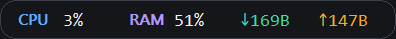
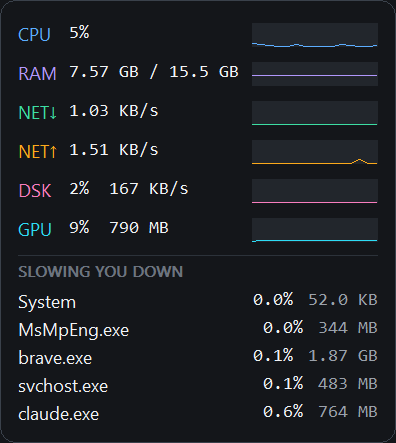
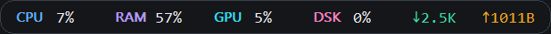
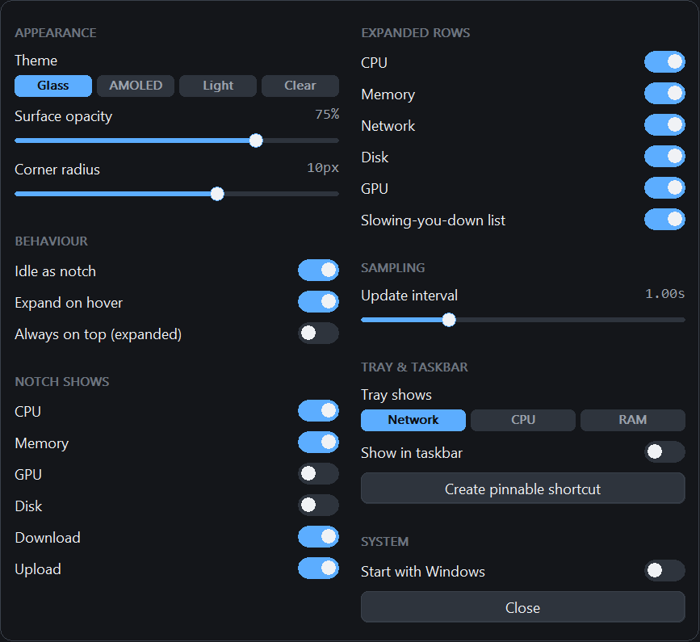
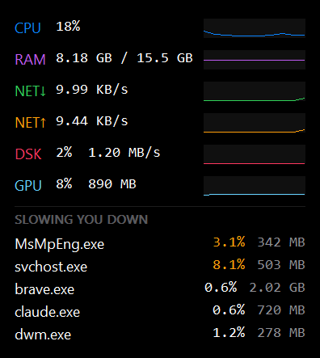
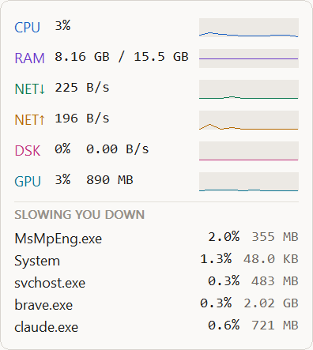
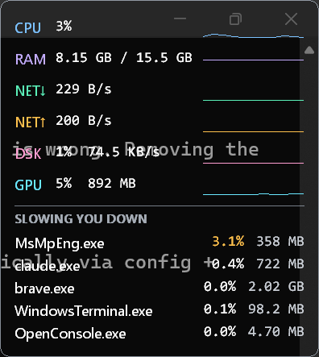
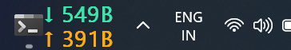

# Offender

**A desktop monitor that tells you *what* is slowing your machine down — not just that it is.**

Idles as a small notch in the corner of your screen. Hover it and the full panel unfolds,
with a ranked list of the processes actually costing you CPU, memory and disk.





## Why this exists

Windows has no shortage of ambient system monitors. What it does not have is one that
answers the question you actually ask when the machine gets slow: *what is doing this?*

[TrafficMonitor](https://github.com/zhongyang219/TrafficMonitor) (46k★) shows you the
numbers but has no per-process view. [System Informer](https://github.com/winsiderss/systeminformer)
has a superb per-process view but it is a full process explorer you open deliberately —
not something you glance at. Offender puts the answer on the always-on surface.

It is also genuinely small: **~15 MB idle**, 0.08% CPU, one native executable with no
runtime to install.

### The "slowing you down" score

Processes are aggregated by image name, so a browser's forty helper processes appear as
one row. Each family is scored per interval:

```
score = 0.50 x (CPU time used / CPU time available)
      + 0.30 x (private bytes / total RAM)
      + 0.20 x (bytes read + written / busiest process this tick)
```

CPU dominates because it is what you feel; memory pressure matters more slowly; I/O
catches the "disk is thrashing" case. The displayed value is EMA-smoothed so the list
does not reshuffle every tick.

## Install

No installer yet. Build it (below) or grab a release binary when one exists.

> **SmartScreen:** the executable is unsigned, so Windows will warn on first run. This is
> expected for an unsigned binary from a new publisher.

## Build

```powershell
winget install --id Microsoft.DotNet.SDK.10 -e     # required
.\build.ps1                                        # dev build
```

A dev build is framework-dependent and runs on the installed .NET runtime.

For the shipping single-file build you also need the MSVC linker, which NativeAOT uses:

```powershell
winget install --id Microsoft.VisualStudio.2022.BuildTools -e `
  --override "--quiet --wait --add Microsoft.VisualStudio.Workload.VCTools --includeRecommended"

.\build.ps1 -Release        # single self-contained exe, no runtime dependency
.\build.ps1 -Release -Run
```

## Using it

By default Offender idles as a **notch** in the lower-right corner, flush against both
edges and sitting directly above the taskbar:



Labels are coloured by metric, values by severity — white normally, amber past 70%, red
past 90% — so a problem is visible without reading any numbers.

| Action | Result |
|---|---|
| **Hover** the notch | Expands to the full panel; collapses when you leave |
| **Click** | Pins the panel open — it stays after the pointer leaves |
| **Click** again | Collapses back to the notch |
| **Drag** | Moves it; snaps to screen edges |
| **Right-click** | Menu: settings, expand/collapse, always on top, theme, exit |
| **Left-click the tray icon** | Hide/show the panel entirely |

The panel grows inward from whichever edges the notch is docked to, so a corner-docked
notch stays in its corner.

While the panel is hidden the sampler halves its rate and stops reading the process table.

### Settings

Right-click → **Settings…**. Every change applies immediately; there is no OK button.
The dialog wears the active theme and lays itself out in as many columns as your screen
needs.



The notch and the expanded panel have **separate** element toggles — a glance and a detail
view rarely want the same set. Notch elements occupy fixed-width slots, so the notch
changes width when you toggle something and never as the digits change; a container that
reflows at 1 Hz is the one thing an ambient readout must not do.

### Themes

| | |
|---|---|
| **Glass** *(default)* | Acrylic blur behind a translucent dark surface |
| **AMOLED** | True `#000000` — pixels actually off on OLED — with high-chroma accents |
| **Light** | Warm off-white with a genuinely different accent set |
| **Clear** | No surface at all; readings float on the wallpaper |





On Clear the opacity slider fades the *surface* while text stays fully opaque, so turning
it down never makes the numbers harder to read. If your wallpaper is busy, nudge opacity
up and a surface fades back in. See [ARCHITECTURE.md](docs/ARCHITECTURE.md#compositing)
for why Clear is composited differently from the rest.

### Taskbar



Two separate things, under **Tray & taskbar**:

- **Show in taskbar** — puts the live readout in the taskbar strip next to the clock.
- **Create pinnable shortcut** — writes a Start Menu shortcut. Windows has blocked
  programmatic taskbar pinning since Windows 8, so appearing in Start (where "Pin to
  taskbar" lives) is the actual mechanism. Also available headless:

  ```powershell
  Offender.exe --make-shortcut
  ```

## Configuration

Settings live in `%APPDATA%\Offender\config.ini` as plain `key=value` text — editable in
Notepad, and deliberately not JSON.

| Key | Default | Meaning |
|---|---|---|
| `x`, `y` | `-1` | Window position; `-1` means "use the default corner" |
| `theme` | `0` | 0 Glass, 1 AMOLED, 2 Light, 3 Clear |
| `opacity` | `190` | Surface alpha, 0–255 |
| `corner_radius` | `10` | 0–16 logical px |
| `interval_ms` | `1000` | Fast-tier sample period, 250–10000 |
| `collapsed` | `1` | Idle as the notch |
| `expand_on_hover` | `1` | Hover expands the panel |
| `always_on_top` | `0` | Applies to the *pinned* panel only |
| `notch_cpu` … `notch_net_up` | mixed | Which elements the notch shows |
| `show_cpu` … `show_processes` | `1` | Which rows the expanded panel shows |
| `tray` | `0` | Tray icon: 0 network, 1 CPU, 2 RAM |
| `embed_in_taskbar` | `0` | Taskbar readout |
| `start_with_windows` | `0` | HKCU Run entry |
| `pin_interface` | empty | Substring of an adapter description to pin |

## Footprint

Measured on the framework-dependent build (AOT will be lower):

| State | Working set | Private | Handles | CPU |
|---|---|---|---|---|
| Idle in the notch | 15.0–17.6 MB | ~11 MB | ~298 | 0.08% of a 12-core machine |
| After using every feature | ~24 MB | ~11 MB | ~324 | — |

Both states are flat — idle held for 4 minutes and the fully-exercised state for 3 more,
with no drift in memory, handles or GDI objects.

**If you measure this yourself, two things look like leaks and are not:**

1. The working set right after launch (~15 MB) is *below* the real steady state, because
   startup ends with `SetProcessWorkingSetSize(-1, -1)` to release the initialisation
   peak. It climbs back as pages are touched. Sampling once at launch and once later shows
   growth that is not growth.
2. Each feature costs a one-time allocation on first use — roughly +7 GDI objects the
   first time settings opens, +6 the first time the panel expands. These plateau
   completely: settings open/close is flat from the 8th cycle through the 32nd,
   expand/collapse from the 10th through the 50th.

## Status and known limitations

Offender is early. It works, it is verified against `psutil` for accuracy, but it has been
exercised on exactly one machine.

- **The NativeAOT build has never been produced** — the MSVC linker was unavailable during
  development. Every footprint figure above is from the framework-dependent build. AOT
  should improve them substantially; it has not been measured.
- **x64 only.** No ARM64 build.
- **Windows 11 only, tested.** Win10 should work — DWM corner rounding is ignored there —
  but is untested.
- **No temperatures, fan speeds or power draw.** These need vendor drivers or admin, and
  are the most-requested feature in this category.
- **No per-application network usage.**
- **Single-monitor testing.** Multi-monitor DPI handling is implemented but unverified.
- **The taskbar readout is opt-in and inherently fragile** — see
  [ARCHITECTURE.md](docs/ARCHITECTURE.md#taskbar-readout).
- **An unexplained memory step** was observed twice after hours of heavy machine activity
  (~+100 kernel handles, +11 MB). It has not been reproduced deliberately or diagnosed.
  PDH state is now bounded as a mitigation, but that is a guess, not a fix.

## Contributing

See [CONTRIBUTING.md](CONTRIBUTING.md). Architecture and rationale:
[docs/ARCHITECTURE.md](docs/ARCHITECTURE.md).

## License

[MIT](LICENSE) © 2026 Zaki Jariwala
